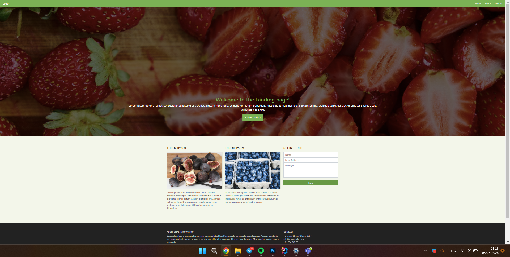

# Exercising with Bootstrap Project



Welcome to the "Exercising with Bootstrap" project! This project serves as a practice exercise to learn and explore
Bootstrap, a popular front-end framework for building responsive and stylish web applications.

## Project Overview

In this project, we'll be working on creating a web page that exercises various features and components provided by
Bootstrap. You'll learn about responsive layout design, navigation bars, forms, cards, and other essential components
that Bootstrap offers.

## Features

- Responsive layout design for various screen sizes.
- Navigation bar integration with dropdown menus.
- Form design and validation using Bootstrap classes.
- Utilization of cards to present information in a visually appealing manner.

## Usage

1. Clone the repository:

   ```bash
   git clone https://github.com/vishchak/exercising-with-bootstrap.git

2. Navigate to the project directory: cd exercising-with-bootstrap
3. Open the index.html file in your preferred web browser to view the project.

## Technologies Used

1. HTML
2. CSS (including Bootstrap)

## Resources

1. Bootstrap Documentation
2. Unsplash - Source for project images.

## Credits

This project is created by Denis Vishchak.
